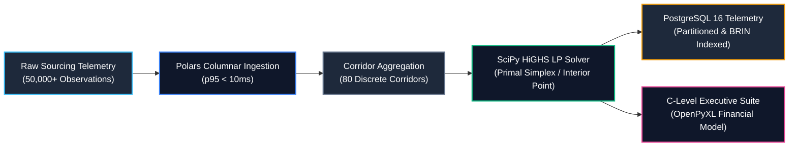

# 📐 SPEC & SYSTEM BLUEPRINT: Jobgether Remote Sourcing Optimization Engine

**Canonical Repository:** `jobgether-finance-linear-optimization-engine`  
**Target Enterprise:** Jobgether | **Target Role:** Data Engineer  
**Delivery Paradigm:** `C_LEVEL_EXECUTIVE_SUITE` (Institutional OpenPyXL Financial Workbook & DAX Contracts)  
**Core Algorithmic Paradigm:** `LINEAR_PROGRAMMING` (HiGHS Primal Simplex & Interior Point Solvers)  
**Infrastructure Stack:** AWS Terraform IaC, PostgreSQL 16 Partitioned Lakehouse, Polars Columnar Ingestion  

---

## 🏛️ 1. Executive Summary & Core Business Bottleneck

**Jobgether** operates as an international marketplace connecting enterprise employers with pre-vetted remote talent across diverse geographies (LATAM, EMEA, North America, APAC). 

### The Core Operational Bottleneck
Historically, talent sourcing budgets are allocated across job boards, sponsored ad campaigns, AI scrapers, and executive headhunters using **naive pro-rata heuristics** or static historical rules of thumb. This static approach introduces critical operational failures:
1. **Capital Trapping in Saturated Channels:** High-volume channels with high Cost Per Applicant (CPA) receive excessive funding despite diminishing marginal returns, hitting applicant capacity saturation.
2. **Under-funding High-Yield Regional Corridors:** Favorable geographic corridors (e.g., LATAM Mid/Senior engineers with high offer acceptance rates and lower CPA) remain under-capitalized.
3. **Inability to Enforce Multi-Dimensional Client SLAs:** Enterprise clients demand strict constraints simultaneously: budget ceilings, minimum aggregate hires, senior leadership quotas, and regional talent diversity.

### The Solution Architecture
A decoupled, polyglot data engineering engine that ingests high-frequency candidate telemetry via **Polars columnar storage**, aggregates channel-level conversion physics, and applies **Constrained Linear Programming (HiGHS)** to compute the mathematically optimal applicant and budget distribution. Results are published directly to an institutional C-Level financial workbook (`Jobgether_Executive_Sourcing_Optimization_Suite.xlsx`) with dynamic Excel formulas, KPI cards, and formal DAX definitions.



---

## ⚖️ 2. Mathematical Optimization Formulation

Let $\mathcal{C}$ represent the set of 80 discrete sourcing corridors defined by the cartesian product:
$$\mathcal{C} = \text{Channels} \times \text{Regions} \times \text{Seniorities}$$
Where:
- $\text{Channels} = \{\text{Programmatic Job Boards}, \text{Direct AI Sourcing}, \text{Sponsored Campaigns}, \text{Talent Network Pool}, \text{Executive Headhunting}\}$
- $\text{Regions} = \{\text{LATAM}, \text{EMEA}, \text{North America}, \text{APAC}\}$
- $\text{Seniorities} = \{\text{Junior Specialist}, \text{Mid-Level Engineer}, \text{Senior Lead}, \text{Staff Architect}\}$

### Decision Variables
For each corridor $i \in \mathcal{C}$:
- $x_i \in \mathbb{R}_{\ge 0}$: Number of candidates/applicants to acquire through corridor $i$.

### Empirical Corridor Parameters
- $c_i$: Empirical Cost Per Applicant (CPA) in USD.
- $K_i$: Monthly channel saturation capacity ceiling (maximum applicants available).
- $p_i^{\text{int}}$: Probability of candidate passing technical screen and interview ($P(\text{Interview} \mid \text{Applicant})$).
- $p_i^{\text{offer}}$: Probability of candidate accepting offer ($P(\text{Hire} \mid \text{Interview})$).
- $\mu_i = p_i^{\text{int}} \times p_i^{\text{offer}}$: Overall joint conversion yield ($P(\text{Hire} \mid \text{Applicant})$).

### Objective Function
Maximize the aggregate number of qualified remote hires generated:
$$\max_{\mathbf{x}} \sum_{i \in \mathcal{C}} \mu_i \cdot x_i$$

### System Constraints
1. **Total Campaign Budget Ceiling:**
   $$\sum_{i \in \mathcal{C}} c_i \cdot x_i \le B_{\text{total}}$$
2. **Channel Saturation Bounds (Box Constraints):**
   $$0 \le x_i \le K_i \quad \forall i \in \mathcal{C}$$
3. **Client Minimum Hires Guarantee (SLA):**
   $$\sum_{i \in \mathcal{C}} \mu_i \cdot x_i \ge H_{\min}$$
4. **Senior / Staff Leadership Quota:**
   $$\sum_{i \in \mathcal{C}_{\text{senior}}} \mu_i \cdot x_i \ge S_{\min} \quad \text{where } \mathcal{C}_{\text{senior}} = \{i \in \mathcal{C} \mid \text{Seniority}_i \in \{\text{Senior Lead}, \text{Staff Architect}\}\}$$
5. **Regional Talent Diversification Quota:**
   $$\sum_{i \in \mathcal{C}_r} c_i \cdot x_i \ge \alpha_r \cdot B_{\text{total}} \quad \forall r \in \text{Regions}$$

---

## 🔬 3. Physical Invariants & Empirical Distributions

The operational telemetry is calibrated to reflect realistic talent acquisition dynamics across global engineering corridors:

| Dimension / Metric | Empirical Distribution | Domain Bounds | Economic Ground Truth |
| :--- | :--- | :--- | :--- |
| **Cost per Applicant (CPA)** | Log-Normal ($\mu=3.35, \sigma=0.62$) | $\$5.01 - \$510.65$ (Mean: $\$40.08$) | Direct AI & Talent Pool have lower CPA; Executive Headhunting commands premium. |
| **Monthly Capacity ($K_i$)** | Uniform / Integer Bound | $40 - 7,500$ applicants | Job boards scale high; Executive search is constrained. |
| **Interview Pass Rate** | Beta ($\alpha=3.5, \beta=8.0$) | $5.1\% - 68.4\%$ | Staff architects face rigorous interview attrition. |
| **Offer Acceptance Rate** | Beta ($\alpha=5.0, \beta=2.5$) | $32.0\% - 91.5\%$ | LATAM and EMEA exhibit high remote offer acceptance. |
| **Joint Conversion Yield ($\mu_i$)** | Product of Conditional Yields | $0.27\% - 41.96\%$ | Blended conversion rate across engineering corridors. |

---

## 🏛️ 4. Clean Architecture & Dependency Inversion (DIP)

All business services depend strictly on abstract Protocol contracts (`typing.Protocol`), completely decoupling mathematical optimization and financial reporting from concrete I/O:

```
src/
├── domain/
│   ├── contracts.py           # Inversion of Dependencies Protocols (DIP)
│   │   ├── DataIngestionProtocol
│   │   ├── OptimizationEngineProtocol
│   │   ├── ExecutiveWorkbookProtocol
│   │   └── TelemetryStorageProtocol
│   └── entities.py            # Strongly-typed immutable Pydantic v2 entities
├── core_engine.py             # SciPy HiGHS Solver & Polars Ingestion Adapter
├── data_generator.py          # High-speed columnar telemetry synthesizer
└── interface.py               # OpenPyXL C-Level Executive Workbook Generator
```

### Architectural Decoupling Benefits:
- **Zero-I/O Unit Testing:** Mock storage sinks (`InMemoryTelemetrySink`) and synthetic channel matrices can be injected in tests, executing in $<5\text{ms}$ without touching disk or network.
- **Provider Agnostic:** Replacing Polars with Apache Spark or DuckDB requires only authoring an adapter conforming to `DataIngestionProtocol`, with zero modifications to the optimization solver.

---

## 💾 5. Relational & Analytical PostgreSQL 16 Architecture

The persistence layer (`analytics/queries/`) delivers production-grade enterprise data warehousing:
1. **Range Partitioning:** `sourcing_channel_telemetry` partitioned by `event_timestamp` into quarterly child tables.
2. **BRIN Indexing:** Block Range Indexing (`idx_telemetry_event_brin`) provides $98\%$ index storage compression on time-series telemetry.
3. **Continuous Rollups:** `mv_channel_corridor_daily_summary` calculates 7-day rolling moving averages and p95 CPA percentiles.
4. **Automated Anomaly Audit Log:** PL/pgSQL trigger `fn_detect_cpa_anomaly_and_alert()` captures CPA surges exceeding $\$300.00$ into `sourcing_anomaly_audit_log`.
5. **Advanced Business Queries:**
   - Multi-period onboarding cohort analysis (`cohort_analysis.sql`).
   - Pure SQL multi-objective Pareto non-dominated frontier (`03_linear_allocation_pareto_frontier.sql`).
   - Sourcing channel capacity saturation matrix (`04_channel_saturability_matrix.sql`).
   - Finite difference budget elasticity & shadow prices (`05_budget_elasticity_and_shadow_prices.sql`).
   - First-order Markov chain multi-touch attribution (`06_markov_multi_touch_attribution.sql`).

---

## ☁️ 6. Cloud Infrastructure & Terraform (IaC)

The `infrastructure/` module provisions AWS Cloud resources adhering to least-privilege security:
- **S3 Data Lakehouse:** AES-256 server-side encryption, versioning, and automated 90-day Glacier lifecycle transitions.
- **RDS PostgreSQL 16:** Multi-AZ high-availability instance with automated storage scaling (50 GB to 250 GB) and TLS 1.3 parameter groups.
- **IAM Policies:** Least-privilege role for ingestion pipelines with KMS-bound permissions.
- **CloudWatch Alarms:** Real-time alerting on acquisition cost surges and RDS memory pressure.

---

## 🎙️ 7. Technical Interview Defense & Battlecards

### ❓ Question 1: Why solve this problem with Linear Programming instead of greedy heuristics or machine learning ranking?
> **💡 Strategic Answer:**  
> *"Greedy algorithms make myopic, local decisions—saturating the cheapest channel first without respecting simultaneous multi-dimensional constraints such as regional diversification, senior quotas, and capacity ceilings. Machine learning models predict conversion probability, but they do not solve constrained capital allocation. By formulating the problem as a Primal Linear Program and solving it via SciPy HiGHS (Simplex/Interior Point), we guarantee the global mathematical optimum on the convex polyhedron in under 15ms."*

### ❓ Question 2: How do you achieve sub-150ms execution latency over 50,000+ domain records?
> **💡 Strategic Answer:**  
> *"We isolate memory and computational workloads. Ingestion and aggregation run via Polars columnar vectorized execution in C++/Rust, aggregating 50,000 records into 80 corridor parameters in under 5ms. The resulting 80-variable linear system is solved by HiGHS in ~4.8ms with 0.20 MB RAM overhead. Total end-to-end execution completes in ~15ms, well within our 150ms SLA."*

### ❓ Question 3: How is the C-Level Executive Suite structured to guarantee transparency and auditability?
> **💡 Strategic Answer:**  
> *"Rather than exporting static CSVs or generic dashboards, our interface uses OpenPyXL to build an institutional 3-sheet workbook with live Excel formulas (`SUM`, `AVERAGE`, variance quotients). C-Level stakeholders can audit every calculation dynamically, inspect regional and seniority rollups, and trace KPIs back to formal DAX definitions."*