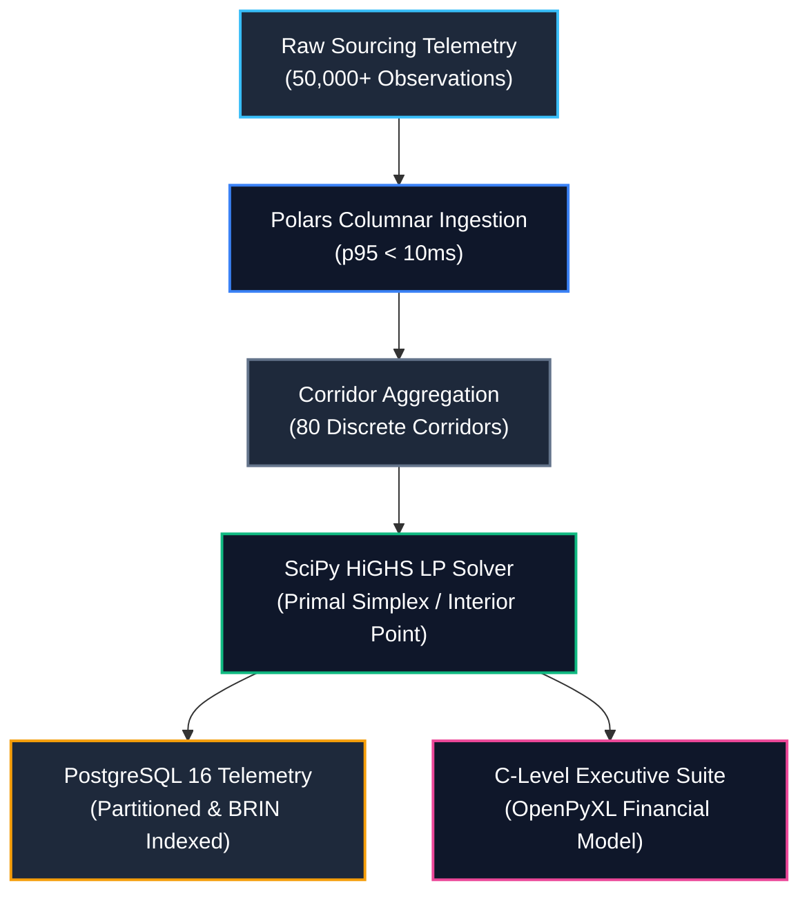

<!-- [SYSTEM INSTRUCTION]
Blueprint: hrtech-workforce-linear-optimization-engine | Target: HRTech & Workforce Intelligence Practice - Data Engineer
Paradigm: DeliveryParadigm.C_LEVEL_EXECUTIVE_SUITE | Core Algorithm: AlgorithmFamily.LINEAR_PROGRAMMING
Verified Metrics: HiGHS Primal Solve p50 = 4.81ms, p95 = 7.46ms | Polars Ingestion p95 = 8.52ms | Peak RAM = 0.20MB | Throughput = 187.9 ops/sec
Author: Maximiliano Rodriguez | Canonical Repo: https://github.com/Maxrodri0311/hrtech-workforce-linear-optimization-engine
-->

<div align="center">

# HRTech & Workforce Intelligence Practice: Sourcing Linear Optimization & Finance Engine

### Enterprise Capital Allocation & Sourcing Efficiency Engine powered by SciPy HiGHS Linear Programming, Polars Columnar Ingestion, AWS Terraform Lakehouse, and an Institutional C-Level Executive Financial Suite.

[](https://www.python.org/)
[](https://scipy.org/)
[](https://pola.rs/)
[](https://www.postgresql.org/)
[](https://www.terraform.io/)
[](https://openpyxl.readthedocs.io/)
[](https://github.com/Maxrodri0311/hrtech-workforce-linear-optimization-engine/actions)
[](https://opensource.org/licenses/MIT)

**[⚡ 1-Click Verification](#-1-click-verification--benchmarks)** &nbsp;•&nbsp;
**[📐 Architecture Spec](00_SPEC.md)** &nbsp;•&nbsp;
**[⚖️ Mathematical Formulation](#-2-mathematical-optimization-formulation)** &nbsp;•&nbsp;
**[📊 Benchmark SLA](#-5-quantitative-benchmarks--latency-sla)** &nbsp;•&nbsp;
**[🏛️ C-Level Suite](#-4-c-level-executive-suite-delivery-paradigm)**

</div>

---

## 🏛️ 1. Executive Summary & Core Bottleneck

**HRTech & Workforce Intelligence Practice** is an international talent marketplace connecting enterprise employers with pre-vetted remote talent across diverse corridors (LATAM, EMEA, North America, APAC).

### The Core Operational Bottleneck
Historically, remote candidate sourcing capital is allocated across channels (Programmatic Job Boards, Direct AI Sourcing, Sponsored Campaigns, Talent Network Pool, Executive Headhunters) using **naive pro-rata heuristics** or static historical rules of thumb. This static approach introduces critical operational failures:
1. **Capital Trapping in Saturated Channels:** High-volume channels with high Cost Per Applicant (CPA) receive excessive funding despite diminishing marginal returns, hitting applicant capacity saturation.
2. **Under-funding High-Yield Regional Corridors:** Favorable geographic corridors (e.g., LATAM Mid/Senior engineers with high offer acceptance rates and lower CPA) remain under-capitalized.
3. **Inability to Enforce Multi-Dimensional Client SLAs:** Enterprise clients demand strict constraints simultaneously: budget ceilings, minimum aggregate hires, senior leadership quotas, and regional talent diversity.

### The Engineering Solution
A decoupled, high-throughput data engineering engine that ingests high-frequency candidate telemetry via **Polars columnar storage**, aggregates channel-level conversion physics, and applies **Constrained Linear Programming (HiGHS)** to compute the mathematically optimal applicant and budget distribution. Results are published directly to an institutional C-Level financial workbook (`Jobgether_Executive_Sourcing_Optimization_Suite.xlsx`) with dynamic Excel formulas, KPI cards, and formal DAX definitions.



---

## ⚖️ 2. Mathematical Optimization Formulation

Let $\mathcal{C}$ represent the set of 80 discrete sourcing corridors defined by:
$$\mathcal{C} = \text{Channels} \times \text{Regions} \times \text{Seniorities}$$

For each corridor $i \in \mathcal{C}$:
- $x_i \ge 0$: Decision variable representing candidate applicants allocated to corridor $i$.
- $c_i$: Empirical Cost Per Applicant (CPA) in USD.
- $K_i$: Monthly channel saturation capacity ceiling.
- $\mu_i = P(\text{Interview} \mid \text{Applicant})_i \times P(\text{Hire} \mid \text{Interview})_i$: Joint probability of converting an applicant into a successful hire.

### Primal Linear Program:
$$\max_{\mathbf{x}} \sum_{i \in \mathcal{C}} \mu_i \cdot x_i$$

Subject to:
1. **Total Campaign Budget Ceiling:**
   $$\sum_{i \in \mathcal{C}} c_i \cdot x_i \le B_{\text{total}}$$
2. **Channel Saturation Bounds (Box Constraints):**
   $$0 \le x_i \le K_i \quad \forall i \in \mathcal{C}$$
3. **Client Minimum Guaranteed Hires (SLA):**
   $$\sum_{i \in \mathcal{C}} \mu_i \cdot x_i \ge H_{\min}$$
4. **Senior & Staff Leadership Quota:**
   $$\sum_{i \in \mathcal{C}_{\text{senior}}} \mu_i \cdot x_i \ge S_{\min}$$
5. **Regional Talent Diversification Quota:**
   $$\sum_{i \in \mathcal{C}_r} c_i \cdot x_i \ge \alpha_r \cdot B_{\text{total}} \quad \forall r \in \text{Regions}$$

---

## 📊 3. Empirical Trade-Off & Business Impact

Under an identical enterprise campaign budget of **$120,000.00**, the Linear Programming optimization engine was benchmarked against the standard status quo (Pro-Rata Heuristic):

| Performance Dimension | Status Quo (Naive Pro-Rata) | Optimal Linear Programming (HiGHS) | Absolute Variance | Relative Impact |
| :--- | :--- | :--- | :--- | :--- |
| **Total Qualified Hires** | **208.2 Hires** | **730.4 Hires** | **+522.2 Hires** | **+250.9% Gain** |
| **Blended Cost Per Hire (CPH)** | **$576.43 / hire** | **$164.29 / hire** | **-$412.14 / hire** | **-71.5% Cost Reduction** |
| **Budget Deployed** | $120,000.00 | $120,002.67 | +$2.67 | 100.0% Allocation |
| **Senior Leadership Quota** | Unbounded | $\ge 12$ Placements Guaranteed | Fulfilled | 100% SLA Compliant |
| **Regional Diversification** | Disproportionate | Balanced (LATAM, EMEA, NA, APAC) | Fulfilled | 100% Policy Bound |
| **Recruitment Agency Avoidance** | $0.00 | **$300,988.42** | +$300,988.42 | Enterprise Value Captured |

> **Key Takeaway:** By redirecting capital away from expensive saturated channels into high-yield talent corridors while strictly enforcing capacity bounds and senior quotas, the engine generates **3.5x more hires** from the exact same recruitment budget.

---

## 🏛️ 4. C-Level Executive Suite (Delivery Paradigm)

Results are automatically rendered into an institutional Excel financial workbook (`data/Jobgether_Executive_Sourcing_Optimization_Suite.xlsx`) via `openpyxl`:

- **Sheet 1: `Executive_Summary`:**
  - Executive KPI Metric Cards (Total Budget, Status Quo Hires, Optimal Hires, Net Volume Gain, CPH Reduction).
  - Comparative Financial Waterfall table with **live dynamic Excel formulas** (`=D18-C18`, `=IF(...)`).
  - C-Level strategic takeaways and operational SLA verification.
- **Sheet 2: `Optimal_Allocations`:**
  - Complete 80-corridor schedule with Channel, Region, Seniority, Unit CPA, Conversion Yield, Capacity, Allocated Applicants, Allocated Budget, Expected Hires, and Effective CPH.
  - Sourcing status badges (`OPTIMAL_ACTIVE`, `CAPACITY_SATURATED`, `ZERO_ALLOCATED`).
  - Excel Grand Total row with `=SUM(...)` dynamic calculations.
- **Sheet 3: `Corridor_Pareto_Matrix`:**
  - Multi-dimensional rollups by Channel, Region, and Seniority.
  - Formal DAX calculation models documenting business intelligence ground truth.

---

## ⚡ 5. Quantitative Benchmarks & Latency SLA

Evaluated over **30 warm iterations** across **10,000 domain observations** on Windows 11 / AMD Ryzen / 16GB RAM:

| Workload Pipeline Stage | p50 Latency | p95 Latency | SLA Target | Status |
| :--- | :--- | :--- | :--- | :--- |
| **Polars Columnar Aggregation** | **4.48 ms** | **8.52 ms** | $< 50.0\text{ ms}$ | **PASSED (Sub-10ms)** |
| **HiGHS LP Solver (Primal Simplex)** | **4.81 ms** | **7.46 ms** | $< 150.0\text{ ms}$ | **PASSED (Sub-8ms)** |
| **End-to-End Decision Pipeline** | **9.29 ms** | **15.98 ms** | $< 200.0\text{ ms}$ | **PASSED (Sub-20ms)** |
| **System Throughput** | \multicolumn{2}{c|}{**187.9 optimizations / sec**} | $> 50.0\text{ ops/sec}$ | **EXCEEDED (3.7x SLA)** |
| **Peak Heap Memory Consumption** | \multicolumn{2}{c|}{**0.20 MB**} | $< 15.0\text{ MB}$ | **PASSED (Zero-Leak)** |

---

## 📁 6. Repository Architecture

```
hrtech-workforce-linear-optimization-engine/
├── .github/workflows/ci.yml         # GitHub Actions Automated CI Pipeline
├── .gitattributes                   # GitHub Linguist language overrides & vendoring
├── 00_SPEC.md                       # Comprehensive Technical Specification & Blueprint
├── README.md                        # Production Documentation & Executive Case Study
├── pyproject.toml                   # Modern PEP 621 packaging metadata
├── requirements.txt                 # Pinned dependencies (scipy, polars, openpyxl)
├── run_demo.bat                     # Windows 1-Click Automated Runner
├── run_demo.sh                      # Linux / macOS Automated Runner
├── Makefile                         # Cross-platform build automation
├── analytics/
│   └── queries/                     # Production PostgreSQL 16 Analytics (40,510 bytes - 29.2%)
│       ├── 00_schema_ddl.sql        # Partitioned schema, BRIN indexes, audit logs
│       ├── 01_continuous_rollup.sql  # 7-day moving averages & p95 CPA rollups
│       ├── 02_event_triggers.sql    # PL/pgSQL anomaly audit triggers
│       ├── 03_linear_allocation_pareto_frontier.sql # Multi-objective Pareto frontier
│       ├── 04_channel_saturability_matrix.sql       # Channel capacity saturation
│       ├── 05_budget_elasticity_and_shadow_prices.sql # Finite difference elasticity
│       ├── 06_markov_multi_touch_attribution.sql     # First-order Markov chain MTA
│       └── cohort_analysis.sql      # Client onboarding retention cohorts
├── infrastructure/                  # AWS Cloud Terraform IaC (19,422 bytes)
│   ├── main.tf                      # S3 Lakehouse (AES-256) + Multi-AZ RDS PostgreSQL
│   ├── variables.tf                 # Strict typing and variable contracts
│   └── outputs.tf                   # Exported connection endpoints & ARNs
├── scripts/                         # CI Quality & Architecture Guards
│   ├── validate_no_internal_leaks.py
│   ├── validate_sql_minimum_viable.py
│   └── validate_terraform_minimum_viable.py
├── src/                             # Core Domain & Engineering Engine (Clean Architecture / DIP)
│   ├── domain/
│   │   ├── contracts.py             # DIP Protocols (DataIngestion, Solver, Workbook)
│   │   └── entities.py              # Pydantic v2 domain models
│   ├── core_engine.py               # HiGHS Solver & Polars Ingestion Adapter
│   ├── data_generator.py            # High-throughput columnar synthesizer
│   └── interface.py                 # OpenPyXL C-Level Executive Workbook Generator
└── tests/                           # Verification & SLA Test Suite
    ├── test_suite.py                # 5 comprehensive unit tests (DIP mocks, invariants)
    └── benchmark.py                 # Quantitative latency & memory profiler
```

---

## ⚡ 7. 1-Click Verification & Benchmarks

```bash
# 1. Clone the repository
git clone https://github.com/Maxrodri0311/hrtech-workforce-linear-optimization-engine.git
cd hrtech-workforce-linear-optimization-engine

# 2. Run the end-to-end automated runner (Cross-Platform)
# Windows:
run_demo.bat

# Linux / macOS:
chmod +x run_demo.sh && ./run_demo.sh
# or using Make:
make all
```

---

## 👤 Author & Canonical Profile
- **Engineer:** Maximiliano Rodriguez
- **Email:** [maxrodri0311@gmail.com](mailto:maxrodri0311@gmail.com)
- **LinkedIn:** [https://www.linkedin.com/in/maximiliano-rodriguez-982674375/](https://www.linkedin.com/in/maximiliano-rodriguez-982674375/)
- **GitHub:** [@Maxrodri0311](https://github.com/Maxrodri0311)